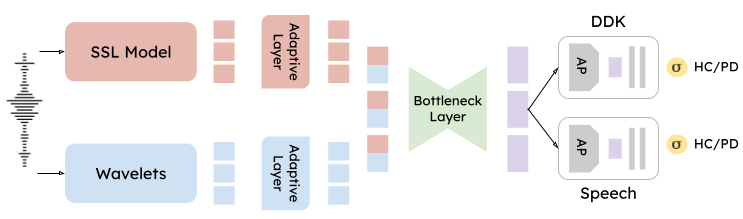

# BDHPD: Bilingual Dual-Head Architecture for Parkinson's Disease Detection from Speech

This repository contains the official implementation of the paper ["Bilingual Dual-Head Deep Model for Parkinson's Disease Detection from Speech"](https://ieeexplore.ieee.org/document/10889445), accepted and presented at ICASSP 2025.

### Overview
BDHPD is a novel deep learning architecture designed for Parkinson's Disease detection from speech signals across multiple languages. The model employs:
- A dual-head architecture specialized for different speech tasks
- Self-supervised learning (SSL) and wavelet-based features
- Adaptive layers for cross-language generalization
- Convolutional bottlenecks for feature refinement
- Contrastive learning for enhanced discriminative capabilities

### Key Features
- Bilingual support: Slovak ([EWA-DB](https://zenodo.org/records/10952480)) and Spanish ([PC-GITA](https://aclanthology.org/L14-1549/))
- Specialized processing for diadochokinetic and continuous speech tasks
- Cross-language generalization capabilities

### Model Architecture
<p align="center">
  
</p>

The model uses a shared backbone for feature extraction, followed by task-specific branches for PD detection.

### Running the Best Configuration

The pre-trained checkpoints for the results presented in the paper are available on the HF Hub: [BDHPD Checkpoints](https://huggingface.co/morenolq/bdhpd-ewa-pcgita).

We provide a script to run the best configuration from our ablation study:

```bash
./run_best_config.sh
```

### Testing the Model

We provide the pre-trained model checkpoints for testing. The script `test_model.sh` is designed to run the testing phase of the model.
The checkpoints are available on the Hugging Face Hub: [BDHPD Checkpoints](https://huggingface.co/morenolq/bdhpd-ewa-pcgita).
Just `git clone https://huggingface.co/morenolq/bdhpd-ewa-pcgita` or download the model files (`wget https://huggingface.co/morenolq/bdhpd-ewa-pcgita/resolve/main/best_model.pt`) to your local machine. To test the model with the best configuration, use the provided script:

```bash
./test_model.sh
```

**Note**: Before running `test_model.sh`, make sure to set the `checkpoint_dir` variable in the script to the path where you downloaded or cloned the Hugging Face model repository (e.g., `/path/to/bdhpd-ewa-pcgita`). The checkpoint manager will take care of loading the model for testing (e.g., `best_model.pt` found using validation).

### Repository Structure
```bash
├── configs/ # Configuration files
├── data_classes/ # Dataset handling classes
├── miners/ # Mining strategies for contrastive learning
├── model_classes/ # Model architecture components
├── dataset_metadata/ # Metadata files for datasets containing the train, test, and validation splits
├── train.py # Main training script
├── utils.py # Utility functions
├── run_best_config.sh # Script to run the best configuration
└── test_model.sh # Script to test the model
```

### Citation
If you use this code or find our work helpful, please cite:
```bibtex
@inproceedings{laquatra2025bilingual,
  title={Bilingual Dual-Head Deep Model for Parkinson's Disease Detection from Speech},
  author={La Quatra, Moreno and Orozco-Arroyave, Juan Rafael and Siniscalchi, Marco Sabato},
  booktitle={ICASSP 2025 - IEEE International Conference on Acoustics, Speech and Signal Processing (ICASSP)},
  year={2025}
}
```